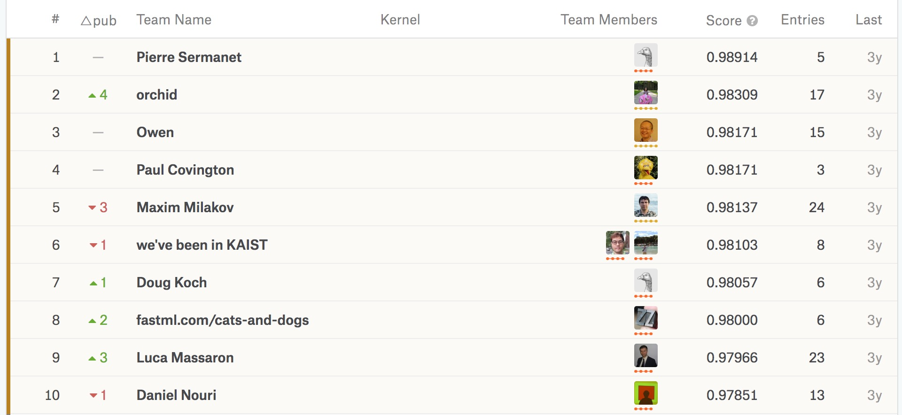

In 2007 released an animal based CAPTCHA called Asirra, which asked a user to categorise a picture as containing a cat or a dog. At the time (a decade ago!), this simple test was enough to tell human from computer. The [conference abstract](https://www.microsoft.com/en-us/research/publication/asirra-a-captcha-that-exploits-interest-aligned-manual-image-categorization/) for Asirra states the following:

> We present Asirra, a CAPTCHA that asks users to identify cats out of a set of 12 photographs of both cats and dogs. Asirra is easy for users; user studies indicate it can be solved by humans 99.6% of the time in under 30 seconds. Barring a major advance in machine vision, we expect computers will have no better than a 1/54,000 chance of solving it. 

Six years later, in 2013, Microsoft must have realised Asirra's time was up. They released 25,000 of the images from the Asirra database to Kaggle, and promoted a competition to see how good a model the general public could make.

The training archive contains 25,000 images of dogs and cats (1 = dog, 0 = cat). Below is the leaderboard from when the competition closed, 3 years ago. To be in the top 10, you need an accuracy of more than 0.979 on the test data. 



To test my data, I used a totally [different dataset of Cat and Dog labelled pictures](http://www.robots.ox.ac.uk/~vgg/data/pets/) from the University of Oxford.

### Packages

```{r}
library(tensorflow)
library(keras)
```


### File locations and settings

```{r}
dir_train <- "train_kaggle"
dir_test <- "test_oxford"
dir_predict <- "predict_kaggle"
img_width <- 150
img_height <- 150
batch_size <- 32
epochs <- 1

n_train <- length(list.files(
  dir_train,
  recursive = TRUE
  ))
n_test = length(list.files(
  dir_test,
  recursive = TRUE
  ))
```

### Loading images

```{r}
# training model data
data_train <- flow_images_from_directory(
  # path to the target directory. It should contain one subdirectory per class
  directory = dir_train, 
  # Image data generator
  generator = image_data_generator(),
  # The dimensions to which all images found will be resized
  target_size = c(img_width, img_height), 
  # one of "grayscale", "rbg"
  color_mode = "rgb",
  # Determines the type of label arrays that are returned
  class_mode = "binary", 
  # int (default: 32)
  batch_size = batch_size, 
  shuffle = TRUE,
  seed = 1234
  # This allows you to optimally specify a directory to which to save 
  # the augmented pictures being generated (useful for visualizing what you are doing).
  # ,save_to_dir 
  )

# validation model data
data_validation <- flow_images_from_directory(
  dir_test, 
  generator = image_data_generator(),
  target_size = c(img_width, img_height), 
  color_mode = "rgb", 
  classes = NULL,
  class_mode = "binary", 
  batch_size = batch_size, 
  shuffle = TRUE,
  seed = 1234
  )
```

## Small Conv Net

### Model architecture definition

```{r}
model <- keras_model_sequential(
  # Keras Model composed of a linear stack of layers
  name = "CatDog"
  ) %>%
  # This layer creates a convolution kernel that is convolved with the 
  #   layer input to produce a tensor of outputs.
  layer_conv_2d(
    # number output of filters in the convolution
    filter = 32,
    # width and height of the 2D convolution window
    kernel_size = c(3,3), 
    # images are 256X256 with 3 channels of colour
    input_shape = c(img_height, img_width, 3)
    ) %>%
  # Rectified Linear Units activation function 
  layer_activation("relu") %>%
  # Max pooling operation for spatial data
  layer_max_pooling_2d(pool_size = c(2,2)) %>% 
  # layer
  layer_conv_2d(filter = 32, kernel_size = c(3,3)) %>%
  layer_activation("relu") %>%
  layer_max_pooling_2d(pool_size = c(2,2)) %>%
  # layer
  layer_conv_2d(filter = 64, kernel_size = c(3,3)) %>%
  layer_activation("relu") %>%
  layer_max_pooling_2d(pool_size = c(2,2)) %>%
  # flatten input
  layer_flatten() %>%
  layer_dense(64) %>%
  layer_activation("relu") %>%
  # dropout rate
  layer_dropout(0.5) %>%
  # output layer
  layer_dense(1) %>%
  layer_activation("sigmoid")

model %>% compile(
  loss = "binary_crossentropy",
  optimizer = optimizer_rmsprop(lr = 0.0001, decay = 1e-6),
  metrics = "accuracy"
)
```

### Training

Takes a few seconds an epoch on GPU and 60s an epoch on CPU

```{r, message=FALSE}
time <- Sys.time()
model_history <- model %>% fit_generator(
  generator = data_train,
  steps_per_epoch = as.integer(n_train/batch_size), 
  epochs = 30, 
  validation_data = data_validation,
  validation_steps = as.integer(n_test/batch_size),
  verbose=2
  )
print(Sys.time()-time)
```

```{r}
library(tibble)
library(ggplot2)

tibble(
    Data = c(
      rep("Training",length(unlist(model_history$history$acc))),
      rep("Validation",length(unlist(model_history$history$val_acc)))
    ),
    Epoch = c(1:length(unlist(model_history$history$acc)),1:length(unlist(model_history$history$val_acc))),
    `Accuracy` = c(unlist(model_history$history$acc),unlist(model_history$history$val_acc)),
    `Loss` = c(unlist(model_history$history$loss),unlist(model_history$history$val_loss))
  ) %>%
  ggplot() +
  geom_point(
    aes(
      x = Epoch, y = Accuracy, colour = Data, shape = Data
    )
  ) +
  ggthemes::theme_hc()


```

```{r}
tibble(
    Data = c(
      rep("Training",length(unlist(model_history$history$acc))),rep("Validation",length(unlist(model_history$history$val_acc)))
    ),
    Epoch = c(1:length(unlist(model_history$history$acc)),1:length(unlist(model_history$history$val_acc))),
    `Accuracy` = c(unlist(model_history$history$acc),unlist(model_history$history$val_acc)),
    `Loss` = c(unlist(model_history$history$loss),unlist(model_history$history$val_loss))
  ) %>%
  ggplot() +
  geom_point(
    aes(
      x = Epoch, y = Loss, colour = Data, shape = Data
    )
  ) +
  ggthemes::theme_hc()
```


```{r}
save_model_weights_hdf5(
  model, 
  'model_main.hdf5',
  overwrite = TRUE)
```


### Evaluating on validation set

Computing loss and accuracy :

```{r}
evaluate_generator(model,data_validation, n_test)
```
